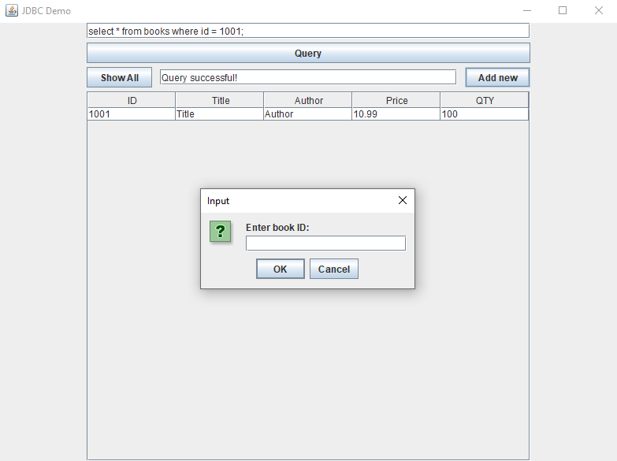
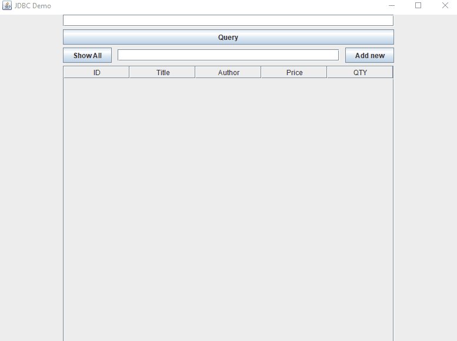

# JDBC_Java_Demo

## Demonstrate the functionality of JDBC



## What?

This simple program was developed for a school project to demonstrate how 
to connect your Java code with a database via JDBC (= Java Database Connectivity).
It uses the Swing-GUI to present a somewhat user-friendly way to interact with
a database.

## How does it work?

First of all, you need the jdbc-driver according to your choice of database.
Since this project uses mariaDB, it is required to download and set up the
mariadb-java-client.jar. The set up can vary depending on which IDE you're using,
when in doubt refer to the documentation of your favourite IDE for further
instructions.

The `DB.java`-class contains the necessary information to establish a connection
to the database (and a specific table in it), in this case a locally 
hosted mariaDB. 
You need to replace the following data with your own:

```java
conn = DriverManager.getConnection(
                    "jdbc:mysql://localhost:3306/ebookshop?allowPublicKeyRetrieval=true&useSSL=false&serverTimezone=UTC",
                    "jdbc_user", "password"); // Super safe and strong password!

            // The format is: "jdbc:mysql://hostname:port/databaseName", "username", "password"
```

The GUI-elements utilize functions that interact with the database, either via
SQL-Query or via SQL-Statement. Current functions are shown below:


